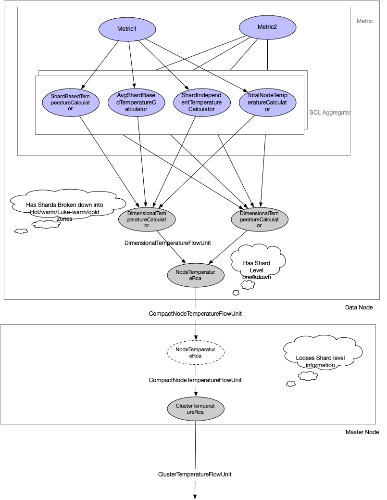

Temperature Profile RCAs
---

## Introduction
Temperature profile is an effort to buid a heatmap at different levels (shard,
node and cluster) based on resource utilization.

### Definitions and concepts
 1. **Dimension** A dimension is a metric
 1. **Temperature** Is a vector of normalized value between 0 and 10, one for each dimension.
 1. **zone** A zone is a division of a dimension into _hot, warm, luke-warm and cold_ regions
 . Each dimension has its own zones. 
 

### Temperature RCA Graph construction
Temperature along each dimension is contributed by a shard-dependent and a shard-independent
 components. For all the metrics
 [here](https://opendistro.github.io/for-elasticsearch-docs/docs/pa/reference/), the metrics that
 have shardID as dimension will have a shard contributed factor to the temperature along that
 dimension. But that metric also might have a factor that is shard independent. For example
 , _CPU_utilization_, has a shard dependent components for the CPU that is spent for various
 elasticsearch Operations. But there are other factors such as HttP server and GC that might
 also consume CPU. The reason we capture both is because the shard dependent part can be affected
 by shard movements but the shard-independent parts might not be affected by shard movements at
 all.
 
 Therefore, for each metric, we aggregate the metric at the SQLite level into 4 different ways
 , which are shown in the image by the SQLAggregator nodes.
  - _By Shard_: They sum up all the CPU consumed between two metric emission points into
  (index name, shardID) pairs. One thing to note is that it sums over operations and give us a table
  something like:
  
  | IndexName | ShardId |  sum(sum) as sum_of_sum |
  |-----------|---------|-------------------------|
  |           |         |                         |
  This is calculated in the class `ShardBasedTemperatureCalculator`.
  
  - _avg over shards_:  This is the average of the table emitted above. You might ask if this
  builds over it, then shouldn't it be a graph node that feeds from it. Well doing this
  calculation in Java layer might be expensive where a node has thousands of shards. But if we
  manage to push it to the SQLite layer, it can be very efficient. Anyways, this is an
  attention detail that is captured in the RCA graph below. The calculation is done
  by class `AvgShardBasedTemperatureCalculator`.
  It emits table as something like this:
  
|  avg(sum) as avg_of_sum |
|-------------------------|
|            -            |

- _Shard independent_: This calculates the sum over all the rows from the metric table where
 shardID is null. This is calculated by `ShardIndependentTemperatureCalculator`.
 
- _total usage for node_: This is the total usage over the everything (shard dependent and shard
-independent) for a given dimension. The class that aggregates this is
 `TotalNodeTemperatureCalculator`.
 
Powered with all these information, the `<DimensionName>DimensionTemperatureRca` class calculates
the temperature along a dimension. The calculation along all the dimensions is very similar except
for the fact that they operate over different metrics. This common piece is extracted away in a
utility class named `DimensionalTemperatureCalculator`.  

Temperatures along each dimension, together form the temperature vector of a node. The
temperature vector of a node is calculated in the class `NodeTemperatureRca`. The summary for
this RCA - `FullNodeTemperatureSummary` has the full picture of a node. It encapsulates the
summary along each dimension in `DimensionalTemperatureSummary` and each dimension also
encloses within themselves the zones for the dimension as part of the inner class 
`ZoneProfileSummary`. There are 4 zones - _hot, warm, luke-warm and cold_. `HeatZoneAssigner`
assigns each shard to a zone by comparing the _shard's temperature_ along that dimension with the
_node average_ temperature along that dimension and _threshold_. Threshold determined by the
constant `THRESHOLD_PERCENT_FOR_HEAT_ZONE_ASSIGNMENT`, which should later be moved to config 
parameter.

The node temperature is required by the downstream RCA node `ClusterTemperatureRca` to calculate
the temperature of the cluster and assign nodes to the same zone - _hot, warm, luke-warm and
cold_. In order to do this calculation, the `ClusterTemperatureRca` does not need the shard level
details or the zonal break down of each of the node dimensions. Therefore, the
`NodeTemperatureRca` sends only the required information encapsulating in a 
`CompactNodeTemperatureSummary` inside the `CompactNodeTemperatureFlowUnit`. This is just enough
information to calculate the cluster temperature.  
        

## Calculating Temperature

### Temperature of a shard
The temperature of a shard is the value returned by the `By Shard` node of the graph normalized
by the total usage along that dimension given by `Node Total` node of the graph. Note that the total
usage is the sum over both the shard dependent and shard-independent values.

### Temperature of a node
The temperature of a node is the average consumption along the dimension by the shards. Be
mindful that this leaves out the shard-independent pieces.

### Temperature of a cluster
The temperature of a cluster is the average consumption along the dimension over all nodes.
This is done by adding the total temperature along a dimension over all nodes and then dividing
over all nodes. Please, note that the total includes the shard dependent and the shard
independent parts. The `ClusterTemperatureRca` also re-calculates the `CompactNodeSummary` for
each node and does not reuse what it got from the nodes themselves. This is because of two
reasons:
 - The node temperature is the average shard consumption along each dimension.
 - The temperature is a normalized value. The normalization factor for a dimension of a node is the
   total consumption  of the node. This changes for a cluster; where the normalization factor is
   the total consumption of the resource along a dimension over all nodes. 
